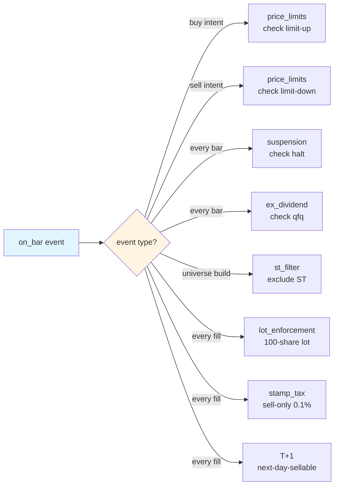

# A 股规则补丁层

!!! info "本页面源文件"
    本页面正文来自 [`backtest/a_share/README.md`](https://github.com/shaok1814-lang/quant-platform/blob/master/backtest/a_share/README.md) — 源文件更新后重新运行 `mkdocs build` 即可同步。

!!! note "一句话总结"
    AKQuant 默认只 enforce `ChinaStockConfig(tick_size=True)`，涨跌停/停牌/除权/ST/幸存者偏差 全部需要自研补丁层 — 8 个独立 pure-function 模块，每个都有 ≥6 个边界单元测试。

## 8 规则速览

| 规则 | 模块 | 触发时机 | 默认行为 | AKQuant 自带？ |
| --- | --- | --- | --- | --- |
| T+1 交割 | (AKQuant `t_plus_one=True`) | 卖出 fill 后 | 次日才能卖 | ✅ |
| 涨跌停 | `price_limits` | buy / sell intent 前 | 涨停禁买、跌停禁卖 | ✅ runner-hook 强制 |
| 停牌 | `suspension` | 每个 bar | 无成交则不参与 | ✅ runner-hook 强制 |
| 除权除息 (qfq) | `ex_dividend` | 每个 bar | qfq 复权 | 数据层 qfq (W2) |
| ST 股票过滤 | `st_filter` | universe 构建时 | 默认过滤 ST | ✅ universe-hook 强制 |
| 100 股整手 | `lot_enforcement` | 每个 fill | 不足 1 手舍入 | ✅ buy-side strict（`close_position` 不 round） |
| 印花税卖单边 | `stamp_tax` | 每个 fill | 卖单 0.1% | ✅ |
| 幸存者偏差 | `delisted_universe` | universe 构建时 | 含退市股票 | ✅ universe-hook 强制 |

!!! warning "AKQuant 默认实现的边界"
    - T+1：AKQuant 内建，但 `close_position` 路径不 round lot（参见 [lot_enforcement 文档](https://github.com/shaok1814-lang/quant-platform/blob/master/backtest/a_share/lot_enforcement.py)）。
    - 涨跌停 / 停牌 / ST / 幸存者偏差：AKQuant 不提供，由 `backtest/a_share/` 4 个 pure-function 模块实现，runner-hook / universe-hook 在生产 pipeline 自动 enforce（自 W7.1 补完后）。
    - qfq 复权：AKQuant 数据层做，但 `ex_dividend` 模块的 sanity-check（除权日 adj_factor 跳变检测）是冗余保险。

!!! note "两阶段 enforce 模式"
    - **Runner-hook**（涨跌停 / 停牌）：`execution/runner.py:_check_intent` 在每个 intent submit 前调 `check_price_limit` + `check_suspension`；通过 `RiskConfig.enable_*_guard` flag + `PaperSessionConfig.board_map` / `st_set` 配置。
    - **Universe-hook**（ST / 退市）：`ops/universe.py:load_filtered_universe` 在 universe 构建时调 `filter_st` + `build_universe(include_delisted=True)`；snapshot 数据来自 `data/{st_a_share,delisted_a_share}_list.csv`（`scripts/snapshot_st_delisted.py` 刷新）。

## 事件触发矩阵

!!! tip "用法模式"
    策略可以 (a) 各自 import 需要的工具函数，或 (b) 在 `on_start` 中 `import AShareRuleChecklist` 并 instantiate — 后者会在策略类上做"自检"（debug 时一目了然你声明了哪些规则）。

--8<-- "a-share-rules-content.md"

---

## 下一步

- 想看 A 股规则在哪一层 enforce → [系统架构](architecture.md#a-share-patches)
- 想看防过拟合 4 条规则 → [防过拟合](anti-overfit.md)
- 想看怎么 4 周模拟盘 → [模拟盘手册](paper-runbook.md)
- 想看每个模块的公开 API → [API 参考](api-reference.md)