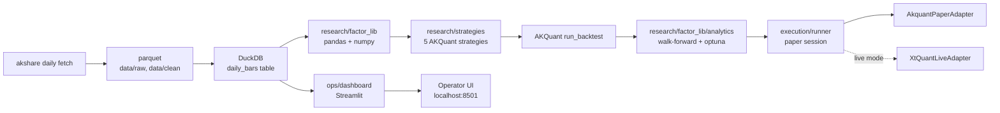
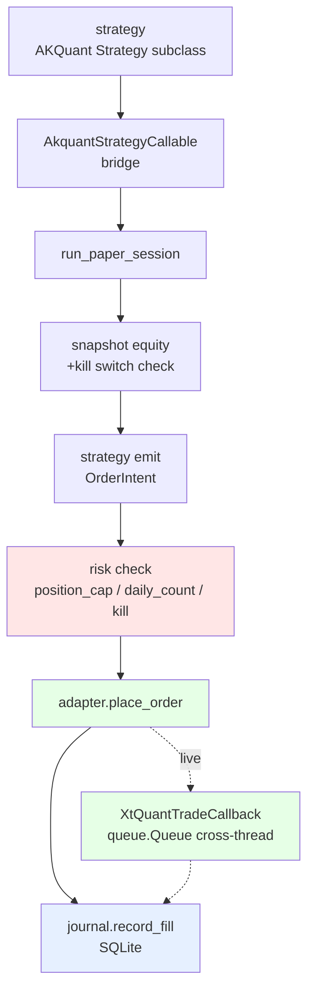
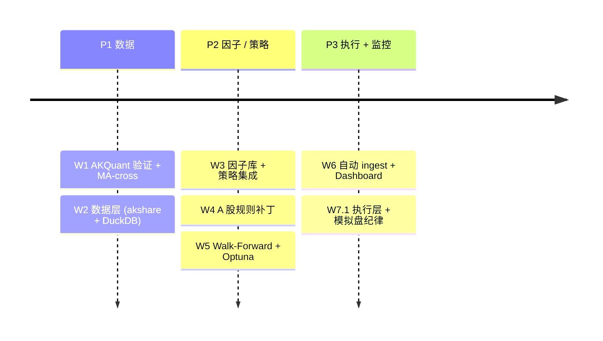
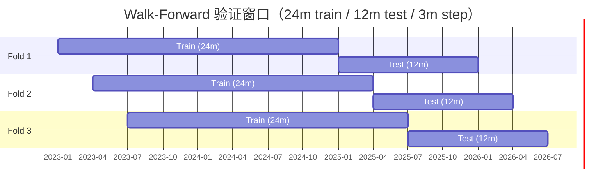
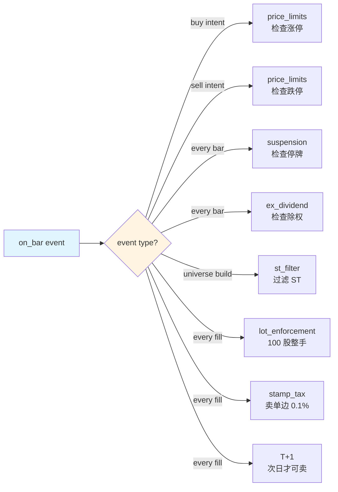

# 系统架构

quant-platform 是 **6 层分层架构**，CLAUDE.md §架构决策 的硬约束在每一层都有具体执行点。

## 分层视图 {#layers}

| 层 | 实现 | 职责 |
| --- | --- | --- |
| **数据采集** {#data-source} | akshare (主) + adata / baostock (校验) | 行情、财务、实时 |
| **数据存储** {#data-storage} | DuckDB + Parquet (自研层) | 复权 / 停牌 / ST 标记 |
| **核心引擎** {#engine} | **AKQuant 直接使用，不修改其源码** | 事件循环 / 订单管理 / 基础回测 |
| **A 股补丁** {#a-share-patches} | 自研模块（在 AKQuant 之上） | ST / 退市 / 可转债 / 涨跌停边界 |
| **因子库** {#factor-library} | 完全自研 | 计算 / 去极值 / 中性化 / 标准化 |
| **绩效归因** {#performance} | 自研 | 含 Walk-Forward 防过拟合 |
| **实盘网关** {#live-gateway} | 自研（xtquant / miniQMT） | 仅在 P3 阶段接入 |

| 层 | 实现 | 职责 |
| --- | --- | --- |
| **数据采集** | akshare (主) + adata / baostock (校验) | 行情、财务、实时 |
| **数据存储** | DuckDB + Parquet (自研层) | 复权 / 停牌 / ST 标记 |
| **核心引擎** | **AKQuant 直接使用，不修改其源码** | 事件循环 / 订单管理 / 基础回测 |
| **A 股补丁** | 自研模块（在 AKQuant 之上） | ST / 退市 / 可转债 / 涨跌停边界 |
| **因子库** | 完全自研 | 计算 / 去极值 / 中性化 / 标准化 |
| **绩效归因** | 自研 | 含 Walk-Forward 防过拟合 |
| **实盘网关** | 自研（xtquant / miniQMT） | 仅在 P3 阶段接入 |

!!! note "CLAUDE.md 硬约束"
    > 禁止直接修改 AKQuant 源码；通过继承 / 包装 / 补丁层实现扩展。如果必须修改，先在 Issue 中讨论并评估是否切换到 rqalpha。

## 数据流

## 执行层 pipeline

策略 → bridge → runner → risk / journal / broker 三条线分流：

## 路线图

完整版本：[CLAUDE.md §6 周路线图](https://github.com/shaok1814-lang/quant-platform/blob/master/CLAUDE.md)。

## 防过拟合：Walk-Forward 滚动窗口 {#walk-forward-windows}

[Walk-Forward](anti-overfit.md) 是本项目强制执行的的验证流程 — 训练 24 个月、测试 12 个月、季度滚动 3 个月，**不允许重叠**：

每个 fold 独立 backtest，独立 Optuna，统计每个 metric 的 IS/OOS 衰减比。完整约束见 [防过拟合](anti-overfit.md)。

## A 股规则：覆盖矩阵 {#rule-coverage-matrix}

每条规则对应不同事件触发 / 不同 bar 处理动作。完整 patch 层 8 规则、纯函数 + ≥6 边界单元测试的详情见 [A 股规则](a-share-rules.md)：

矩阵决定了**哪条规则对应哪种 on_bar event**，避免遗漏。

---

## 下一步

- 8 条 A 股规则的细节 → [A 股规则](a-share-rules.md)
- 防过拟合 4 条规则 + Walk-Forward → [防过拟合](anti-overfit.md)
- 4 周模拟盘纪律 → [模拟盘手册](paper-runbook.md)
- 想看 17 框架对比 → [框架调研](framework-survey.md)