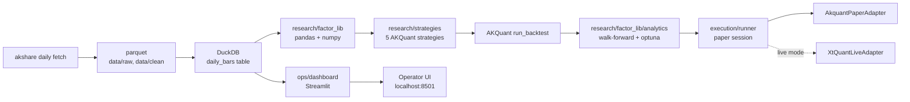
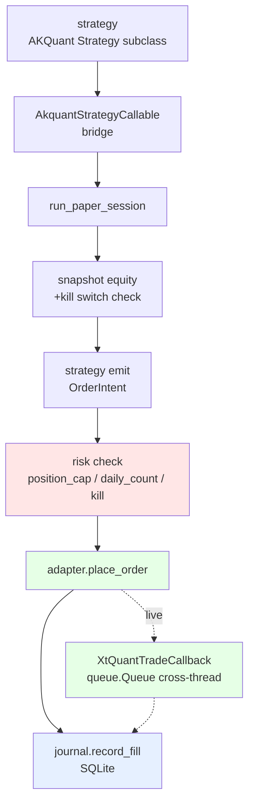
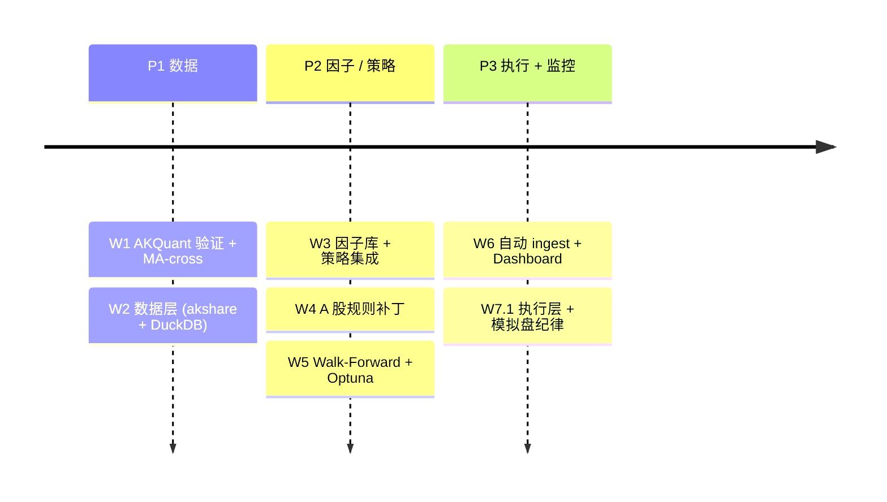

# 系统架构

quant-platform 是 **6 层分层架构**，CLAUDE.md §架构决策 的硬约束在每一层都有具体执行点。

## 分层视图 {#layers}

| 层 | 实现 | 职责 |
| --- | --- | --- |
| **数据采集** {#data-source} | akshare (主) + adata / baostock (校验) | 行情、财务、实时 |
| **数据存储** {#data-storage} | DuckDB + Parquet (自研层) | 复权 / 停牌 / ST 标记 |
| **核心引擎** {#engine} | **AKQuant 直接使用，不修改其源码** | 事件循环 / 订单管理 / 基础回测 |
| **A 股补丁** {#a-share-patches} | 自研模块（在 AKQuant 之上） | ST / 退市 / 可转债 / 涨跌停边界 |
| **因子库** {#factor-library} | 完全自研 | 计算 / 去极值 / 中性化 / 标准化 |
| **绩效归因** {#performance} | 自研 | 含 Walk-Forward 防过拟合 |
| **实盘网关** {#live-gateway} | 自研（xtquant / miniQMT） | 仅在 P3 阶段接入 |

| 层 | 实现 | 职责 |
| --- | --- | --- |
| **数据采集** | akshare (主) + adata / baostock (校验) | 行情、财务、实时 |
| **数据存储** | DuckDB + Parquet (自研层) | 复权 / 停牌 / ST 标记 |
| **核心引擎** | **AKQuant 直接使用，不修改其源码** | 事件循环 / 订单管理 / 基础回测 |
| **A 股补丁** | 自研模块（在 AKQuant 之上） | ST / 退市 / 可转债 / 涨跌停边界 |
| **因子库** | 完全自研 | 计算 / 去极值 / 中性化 / 标准化 |
| **绩效归因** | 自研 | 含 Walk-Forward 防过拟合 |
| **实盘网关** | 自研（xtquant / miniQMT） | 仅在 P3 阶段接入 |

!!! note "CLAUDE.md 硬约束"
    > 禁止直接修改 AKQuant 源码；通过继承 / 包装 / 补丁层实现扩展。如果必须修改，先在 Issue 中讨论并评估是否切换到 rqalpha。

## 数据流

## 执行层 pipeline

策略 → bridge → runner → risk / journal / broker 三条线分流：

完整模块清单见 [API 参考](api-reference.md) + 各模块 README。

## 路线图

完整版本：[CLAUDE.md §6 周路线图](https://github.com/shaok1814-lang/quant-platform/blob/master/CLAUDE.md)。