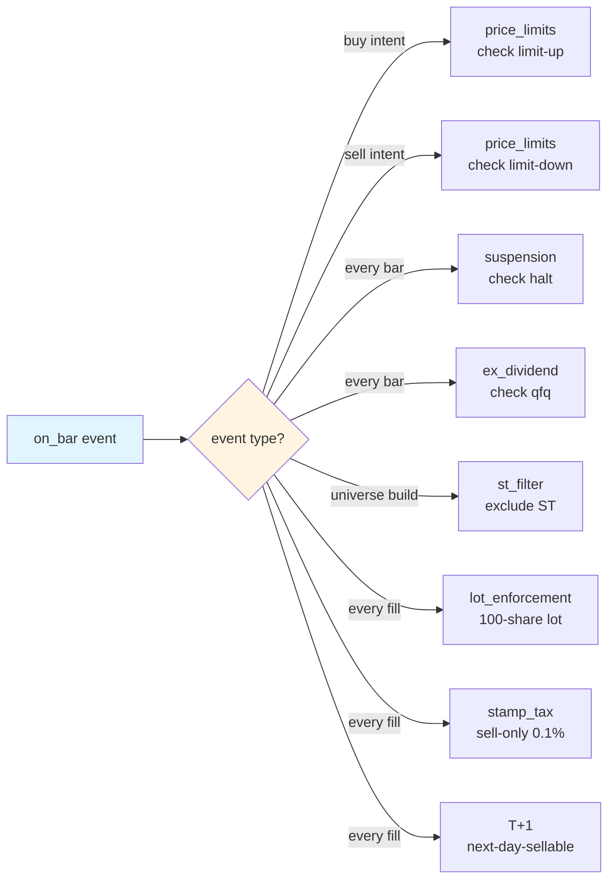

# A-Share Rules Patch Layer

!!! info "Source file"
    This page imports [`backtest/a_share/README.md`](https://github.com/shaok1814-lang/quant-platform/blob/master/backtest/a_share/README.md) verbatim. Edit the source.

!!! note "One-line summary"
    AKQuant only enforces `ChinaStockConfig(tick_size=True)` out of the box; price-limits / suspension / ex-div / ST / survivorship-bias all require a self-research patch layer — 8 pure-function modules, each with ≥6 boundary unit tests.

## 8 rules at a glance

| Rule | Module | Trigger | Default behavior | AKQuant built-in? |
| --- | --- | --- | --- | --- |
| T+1 settlement | (AKQuant `t_plus_one=True`) | after sell fill | next-day-sellable | yes |
| Price limits | `price_limits` | before buy / sell intent | reject limit-up buy, reject limit-down sell | yes (runner-hook enforced) |
| Suspension | `suspension` | every bar | no fill when halted | yes (runner-hook enforced) |
| Ex-dividend (qfq) | `ex_dividend` | every bar | qfq adjust | data-layer qfq (W2) |
| ST stock filter | `st_filter` | at universe build | default excludes ST | yes (universe-hook enforced) |
| 100-share lot | `lot_enforcement` | every fill | round-down to nearest lot | yes buy-side strict (`close_position` bypasses) |
| Stamp tax (sell only) | `stamp_tax` | every fill | 0.1% on sells | yes |
| Survivorship bias | `delisted_universe` | at universe build | include delisted | yes (universe-hook enforced) |

!!! warning "Edges of AKQuant's built-ins"
- T+1: AKQuant built-in, but `close_position` path does NOT round lots (see [`lot_enforcement`](https://github.com/shaok1814-lang/quant-platform/blob/master/backtest/a_share/lot_enforcement.py)).
- Price limits / suspension / ST / survivorship: AKQuant does NOT provide. The 4 `backtest/a_share/` pure-function modules implement the rules, and the runner-hook / universe-hook layers auto-enforce them in the production pipeline (since W7.1 follow-up).
- qfq adjustment: AKQuant's data layer handles it, but `ex_dividend`'s sanity-check (adj_factor jump detection) is redundant insurance.

!!! note "Two-tier enforcement pattern"
- **Runner-hook** (price-limits / suspension): `execution/runner.py:_check_intent` calls `check_price_limit` + `check_suspension` before submitting each intent. Configurable via `RiskConfig.enable_*_guard` + `PaperSessionConfig.board_map` / `st_set`.
- **Universe-hook** (ST / survivorship): `ops/universe.py:load_filtered_universe` calls `filter_st` + `build_universe(include_delisted=True)` at universe build time. Snapshots from `data/{st_a_share,delisted_a_share}_list.csv` (refreshed by `scripts/snapshot_st_delisted.py`).

## Event-trigger matrix

!!! tip "Usage pattern"
    Strategies can either (a) `import` the specific utility functions they need, or (b) instantiate `AShareRuleChecklist` in `on_start` — the latter pattern makes self-attestation visible at debug time (you can see which rules a strategy declared).

--8<-- "a-share-rules-content.md"

---

## Next steps

- Where the A-share rules are enforced → [Architecture](../architecture.md#a-share-patches)
- The 4 anti-overfit rules → [Anti-Overfit](../anti-overfit.md)
- How to run the 4-week paper discipline → [Paper-Validation Runbook](../paper-runbook.md)
- Public API for each module → [API Reference](../api-reference.md)