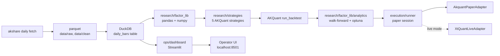
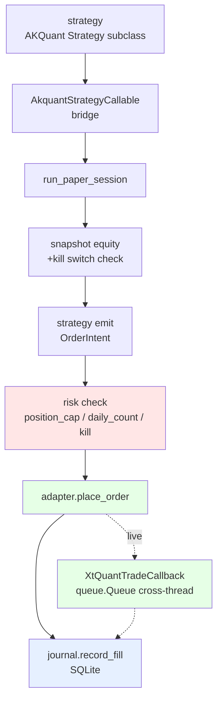
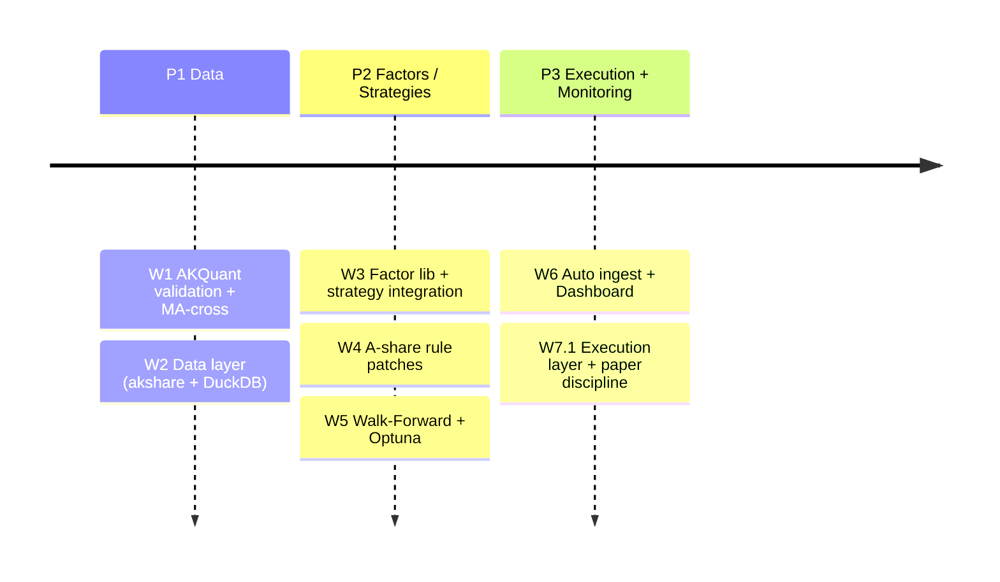

# System Architecture

quant-platform is a **6-layer layered architecture**. CLAUDE.md §架构决策 hard constraints have explicit enforcement points at each layer.

## Layered view {#layers}

| Layer | Implementation | Responsibility |
| --- | --- | --- |
| **Data ingestion** {#data-source} | akshare (primary) + adata / baostock (validator) | Quotes, fundamentals, realtime |
| **Data storage** {#data-storage} | DuckDB + Parquet (self-research layer) | Adjust-factor / suspension / ST flag |
| **Core engine** {#engine} | **AKQuant directly used; no source modifications** | Event loop / order management / base backtest |
| **A-share patches** {#a-share-patches} | Self-research modules (on top of AKQuant) | ST / delisted / convertible bonds / price-limit boundaries |
| **Factor library** {#factor-library} | Fully self-research | Compute / winsorize / neutralize / standardize |
| **Performance attribution** {#performance} | Self-research | Includes Walk-Forward anti-overfit |
| **Live gateway** {#live-gateway} | Self-research (xtquant / miniQMT) | Connected only at P3 stage |

| Layer | Implementation | Responsibility |
| --- | --- | --- |
| **Data ingestion** | akshare (primary) + adata / baostock (validator) | Quotes, fundamentals, realtime |
| **Data storage** | DuckDB + Parquet (self-research layer) | Adjust-factor / suspension / ST flag |
| **Core engine** | **AKQuant directly used; no source modifications** | Event loop / order management / base backtest |
| **A-share patches** | Self-research modules (on top of AKQuant) | ST / delisted / convertible bonds / price-limit boundaries |
| **Factor library** | Fully self-research | Compute / winsorize / neutralize / standardize |
| **Performance attribution** | Self-research | Includes Walk-Forward anti-overfit |
| **Live gateway** | Self-research (xtquant / miniQMT) | Connected only at P3 stage |

!!! note "CLAUDE.md hard constraint"
    > Forbidden to modify AKQuant source directly; extend via inheritance / wrapping / patch layer. If modification is required, discuss in Issue first and evaluate switching to rqalpha.

## Data flow

## Execution pipeline

Strategy → bridge → runner → risk / journal / broker tri-fork:

Full module inventory: [API reference](api-reference.md) + each module's README.

## Roadmap

Full version: [CLAUDE.md §6-week roadmap](https://github.com/shaok1814-lang/quant-platform/blob/master/CLAUDE.md).