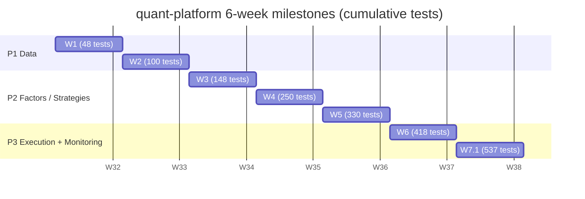

# Project Timeline

6 weeks from zero to P3 fully closed. The table below summarizes each week's deliverables + cumulative test count + brief retrospectives.

## 6-week milestones



## Per-week details

| Phase | W | Focus | Key modules | Tests | Key decision that week |
| --- | --- | --- | --- | --- | --- |
| **P1 W1** | 1 | AKQuant validation + MA-cross smoke | `research/strategies/ma_cross.py` | ~48 | Pick AKQuant as engine (17-framework decision) |
| **P1 W2** | 2 | Data layer (akshare + Parquet + DuckDB + cross-source) | `data_layer/`, `ops/cross_source_job.py` | ~100 | akshare primary + baostock validator; qfq canonical adjust-mode |
| **P2 W3** | 3 | Factor library + strategy integration | `research/factor_lib/` (4 families), `research/strategies/` (2 strategies) | ~148 | 4 alpha families cover the main alpha categories |
| **P2 W4** | 4 | A-share rule patches (full coverage) | `backtest/a_share/` | ~250 | 100 boundary tests, ≥6 per rule |
| **P2 W5** | 5 | Walk-Forward + Optuna + parameter sensitivity | `research/factor_lib/analytics/` | ~330 | 24m/12m/3m windows; ±20% tolerance; grid search banned |
| **P3 W6** | 6 | Auto-ingest + Dashboard + cross-source audit + DingTalk alerts | `ops/ingest_job.py`, `ops/dashboard.py`, `ops/notify.py`, `ops/scheduler.py` | ~418 | 3-page Streamlit; APScheduler cron; DingTalk alerts |
| **P3 W7.1** | 7 | Execution layer (paper + xtquant live + bridge + paper discipline) | `execution/` (protocol/risk/runner/brokers/journal/bridge), `ops/weekly_paper_job.py`, `scripts/run_paper_validation.py` | **537** | Multi-symbol bridge + runner auto-sync `update_position` + 5-phase execution layer |

!!! abstract "How to read this table"
- **Cumulative tests** doesn't mean "5 new tests = +5". It includes bug fixes, refactors, new modules, and additional boundary cases for old modules. `pytest -q` runs the full suite in ~30 seconds.
- **Key modules** column only lists code paths added or upgraded that week, not all work done that week.
- **Key decision that week** column captures the most important design judgment.
- Full commit history + per-commit design decisions + bug post-mortems live in the [GitHub commit log](https://github.com/shaok1814-lang/quant-platform/commits/master).

## Why this is a real project (vs a tutorial demo)

!!! tip "Details behind the 537 number"
- **48 → 537 is a real 6-week arc**, not written in one shot. ~5 real bug post-mortems along the way:
  - W2.1 akshare proxy issue (Windows netsh winhttp occasionally RSTs eastmoney.com TLS; baostock TCP path bypasses it)
  - W3 IntParam naming trap (AKQuant `IntParam` fields must be inline in class body; `__init_subclass__` stashes them in `__own_param_specs__`)
  - W4 A-share rule coverage gap with AKQuant's actual implementation (AKQuant's `t_plus_one=True` but `close_position` doesn't round lots — must self-patch)
  - W6.3 akshare vs baostock qfq drift of 67-363 bps (akshare-direct vs baostock-direct use different parsers; qfq adjust-points don't strictly align — **first measured cross-source drift**)
  - W7.1 cost-basis paper mode `max_drawdown_pct = 0%` ambiguity (session-local is 0; lifetime HWM is what kill-switch uses — later clarified to query adapter's `query_account().drawdown_pct`)
- **4 of the 8 hard constraints in CLAUDE.md have dedicated enforcement code**:
  - 10% position cap → [`execution/risk.py:check_position_cap`](https://github.com/shaok1814-lang/quant-platform/blob/master/execution/risk.py)
  - 5% drawdown kill → [`execution/risk.py:check_drawdown_kill_switch`](https://github.com/shaok1814-lang/quant-platform/blob/master/execution/risk.py)
  - 4-week paper discipline → [`ops/weekly_paper_job.py`](https://github.com/shaok1814-lang/quant-platform/blob/master/ops/weekly_paper_job.py) + [`ops/scheduler.py`](https://github.com/shaok1814-lang/quant-platform/blob/master/ops/scheduler.py)
  - Anti-overfit → [`research/factor_lib/analytics/`](https://github.com/shaok1814-lang/quant-platform/tree/master/research/factor_lib/analytics)
- **No modifications to AKQuant source** (CLAUDE.md core architecture decision) — all extensions via subclassing / wrapping / patch layer. [`execution/brokers/akquant_paper.py`](https://github.com/shaok1814-lang/quant-platform/blob/master/execution/brokers/akquant_paper.py) wrapping AKQuant's `MiniQMTTraderGateway` stub is the most explicit example.

## Commit rhythm (selected highlights)

```text
feat(W1): akquant 验证 + 雙均線策略跑通 + A股規則測試
feat(W2.1): fetcher + parquet + DuckDB 落地, drift = 0
feat(W2.2): 跨源校驗 + akshare fallback + turnover schema 收斂
feat(W3): 因子庫 4 類 4 因子 + post-processors + pipeline + 2 真策略
feat(W4): A股規則補丁層 (8 規則 + 100 測試)
feat(W5): walk_forward + optuna + param_sensitivity
feat(W6.1): data auto-reflow — universe + quality + notify + ingest + scheduler
feat(W6.2): Streamlit dashboard (Universe + Equity + Trade History)
feat(W6.3): dual-fetch 跨源 + SOFT 釘聊告警
feat(W7.1): execution skeleton
feat(W7.1 Phase 2): XtQuantLiveAdapter + W3 bridge
feat(W7.1 Phase 3): 釘聊 SOFT alert on kill switch
feat(W7.1 Phase 4): multi-symbol bridge + auto-sync update_position
feat(W7.1 Phase 5): XtQuantLiveAdapter 釘聊 on reconnect exhausted + drop
feat(E): multi-account paper session
feat(F): Donchian Channel Breakout strategy (Turtle S1)
feat(D): 4-week paper-validation launch — pre-flight + runbook + smoke
chore(G): mypy strict pass + ruff format cleanup
```

## Next steps

- **4-week paper discipline starts now** — `python scripts/run_paper_validation.py` pre-flight → `python -m ops` launch. Sunday 9:00 CST auto-runs the paper session; first paper-vs-live deviation assessment after 4 weeks.
- **CLAUDE.md "single-strategy initial live capital ≤ 10% of total"** — once paper-vs-live deviation is < 5%, start live with first trade capital ≤ 10% of total.
- **More strategies / factors** — currently 5 strategies × 4 factor families. Next: Donchian System 2 (pyramiding + ATR sizing), Dual Momentum, pairs trading.

---

## Next steps

- See the 6-layer architecture → [Architecture](architecture.md)
- Public API for each module → [API Reference](api-reference.md)
- Per-commit design decisions → [GitHub commits](https://github.com/shaok1814-lang/quant-platform/commits/master)