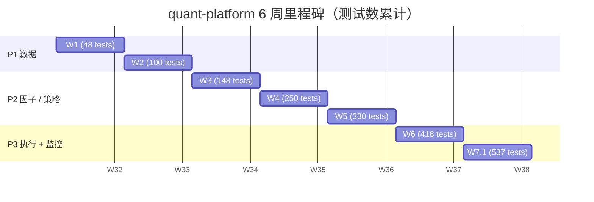

# 项目时间线

6 周从零到 P3 全闭环。下表汇总每周的关键交付 + 测试数累计 + 简短回顾。

## 6 周里程碑



## 每周详情

| 阶段 | 周 | 主题 | 关键模块 | 测试数 | 该周核心决策 |
| --- | --- | --- | --- | --- | --- |
| **P1 W1** | 1 | AKQuant 验证 + MA-cross 烟雾测试 | `research/strategies/ma_cross.py` | ~48 | 选 AKQuant 作核心引擎（17 框架调研结论） |
| **P1 W2** | 2 | 数据层（akshare + Parquet + DuckDB + 跨源校验） | `data_layer/`, `ops/cross_source_job.py` | ~100 | akshare 主 + baostock 校验；qfq 前复权统一口径 |
| **P2 W3** | 3 | 因子库 + 策略集成 | `research/factor_lib/`（4 家族）, `research/strategies/`（2 真策略） | ~148 | 4 家族（trend/momentum/mean-rev/liquidity）覆盖 alpha 主类 |
| **P2 W4** | 4 | A 股规则补丁层（8 规则全覆盖） | `backtest/a_share/` | ~250 | 100 个边界单元测试，每个规则 ≥6 |
| **P2 W5** | 5 | Walk-Forward + Optuna + 参数敏感度 | `research/factor_lib/analytics/` | ~330 | 24m/12m/3m 窗口；±20%  容忍；拒绝 grid search |
| **P3 W6** | 6 | 自动 ingest + Dashboard + 跨源 audit + 钉聊告警 | `ops/ingest_job.py`, `ops/dashboard.py`, `ops/notify.py`, `ops/scheduler.py` | ~418 | 3-page Streamlit；apscheduler cron；钉聊 alert |
| **P3 W7.1** | 7 | 执行层（paper + xtquant live + 桥接 + 模拟盘纪律） | `execution/`（protocol/risk/runner/brokers/journal/bridge），`ops/weekly_paper_job.py`, `scripts/run_paper_validation.py` | **537** | 多 symbol 桥接 + runner auto-sync `update_position` + 5-phase execution layer |

!!! abstract "怎么读这张表"
    - **测试数累计** 不是 5 个新测试写完就 +5 — 包含修 bug、refactor、新模块、旧模块的额外边界 case 累计。`pytest -q` 跑全套 ~30 秒。
    - **关键模块** 列只挑该周新增 / 升级的代码路径，不是该周的全部工作。
    - **该周核心决策** 列是该周最重要的设计判断（commit hash + 设计意图）。
    - 完整 commit history + 每个 commit 的设计决策 + bug post-mortem 在 [GitHub commit log](https://github.com/shaok1814-lang/quant-platform/commits/master)。

## 为什么这是真实的项目（vs 教程 demo）

!!! tip "几个 537 这个数字背后的细节"
    - **从 48 → 537 是真实的 6 周弧线**，不是一次写出来的。中间遇到 ~5 个真实 bug post-mortem：
        - W2.1 akshare 代理问题（Windows netsh winhttp 偶发  RST eastmoney.com TLS，baostock TCP 路径绕开）
        - W3 IntParam 命名陷阱（AKQuant `IntParam` 字段必须 inline class-body，且 `__init_subclass__` 把它存到 `__own_param_spec__`s` 字典）
        - W4 A-share 规则与 AKQuant 实际实现的差异（AKQuant `t_plus_one=True` 但 `close_position` 不 round lot — 必须自研补丁）
        - W6.3 akshare vs baostock qfq drift 67-363 bps（akshare 直接 vs baostock 直接走不同 parser，qfq 复权位点不严格对齐，**第一次实测到的真实跨源 diff**）
        - W7.1 cost-basis paper mode 下 `max_drawdown_pct = 0%` 的歧义（session-local 是 0，但 lifetime HWM 才是 kill-switch 信号 — 后来明确用 adapter `query_account().drawdown_pct`）
    - **CLAUDE.md 的 8 条硬约束 4 条都有专门的 enforcement 代码**：
        - 10% 仓位 cap → [`execution/risk.py:check_position_cap`](https://github.com/shaok1814-lang/quant-platform/blob/master/execution/risk.py)
        - 5% drawdown kill → [`execution/risk.py:check_drawdown_kill_switch`](https://github.com/shaok1814-lang/quant-platform/blob/master/execution/risk.py)
        - 4 周模拟盘纪律 → [`ops/weekly_paper_job.py`](https://github.com/shaok1814-lang/quant-platform/blob/master/ops/weekly_paper_job.py) + [`ops/scheduler.py`](https://github.com/shaok1814-lang/quant-platform/blob/master/ops/scheduler.py)
        - 防过拟合 → [`research/factor_lib/analytics/`](https://github.com/shaok1814-lang/quant-platform/tree/master/research/factor_lib/analytics)
    - **不修改 AKQuant 源码**（CLAUDE.md 核心架构决策）— 所有扩展通过继承 / 包装 / 补丁层实现。[`execution/brokers/akquant_paper.py`](https://github.com/shaok1814-lang/quant-platform/blob/master/execution/brokers/akquant_paper.py) 包装 AKQuant `MiniQMTTraderGateway` stub 是最显式的例子。

## 关键 commit 节奏（按 commit 时间）

```text
feat(W1): akquant 验证 + 双均线策略跑通 + A股规则测试
feat(W2.1): fetcher + parquet + DuckDB 落地, drift = 0
feat(W2.2): 跨源校验 + akshare fallback + turnover schema 收敛
feat(W3): 因子库 4 类 4 因子 + post-processors + pipeline + 2 真策略
feat(W4): A股规则补丁层 (8 规则 + 100 测试)
feat(W5): walk_forward + optuna + param_sensitivity
feat(W6.1): data auto-reflow — universe + quality + notify + ingest + scheduler
feat(W6.2): Streamlit dashboard (Universe + Equity + Trade History)
feat(W6.3): dual-fetch 跨源 + SOFT 钉聊告警
feat(W7.1): execution skeleton
feat(W7.1 Phase 2): XtQuantLiveAdapter + W3 bridge
feat(W7.1 Phase 3): 钉聊 SOFT alert on kill switch
feat(W7.1 Phase 4): multi-symbol bridge + auto-sync update_position
feat(W7.1 Phase 5): XtQuantLiveAdapter 钉聊 on reconnect exhausted + drop
feat(E): multi-account paper session
feat(F): Donchian Channel Breakout strategy (Turtle S1)
feat(D): 4-week paper-validation launch — pre-flight + runbook + smoke
chore(G): mypy strict pass + ruff format cleanup
```

## 下一步

- **4 周模拟盘纪律正式开始** — `python scripts/run_paper_validation.py` pre-flight → `python -m ops` launch。Sunday 9:00 CST 自动 paper session，4 周后首次评估 paper vs live deviation。
- **CLAUDE.md「单策略初始实盘资金不超过总资金 10%」** — 等 paper vs live deviation < 5% 后启动实盘，第一笔资金 ≤ 总资金 10%。
- **更多策略 / 因子** — 现在有 5 策略 × 4 因子家族，下一步可以加 Donchian System 2（pyramiding + ATR sizing）、Dual Momentum、pairs trading 等。

---

## 下一步

- 想看 6 层架构 → [系统架构](architecture.md)
- 想看每个模块的公开 API → [API 参考](api-reference.md)
- 想看每个 commit 的设计决策 → [GitHub commits](https://github.com/shaok1814-lang/quant-platform/commits/master)